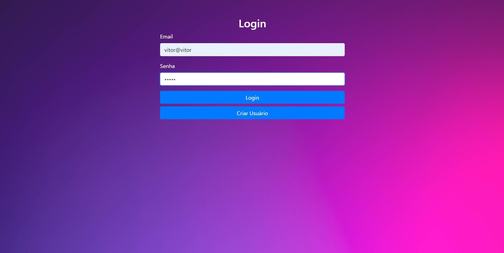
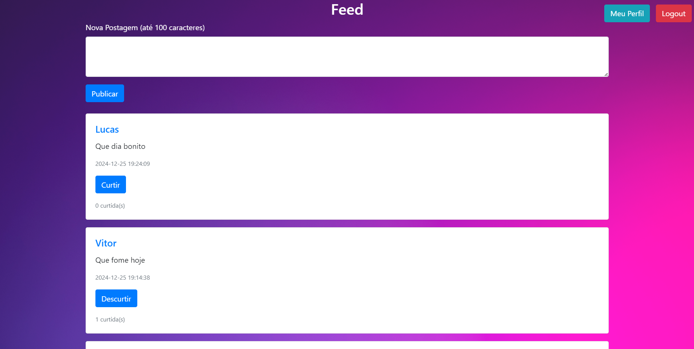
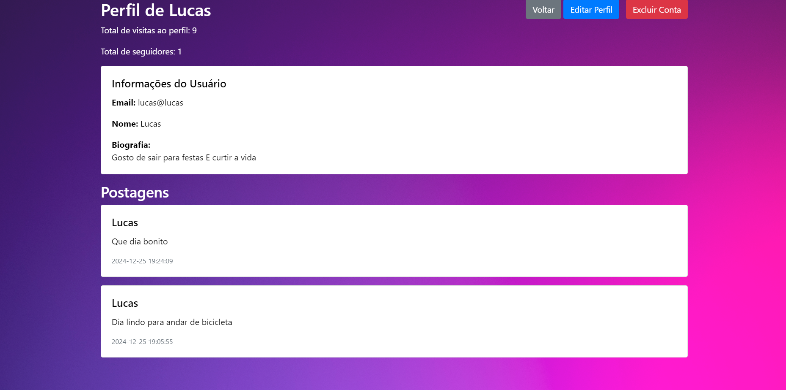
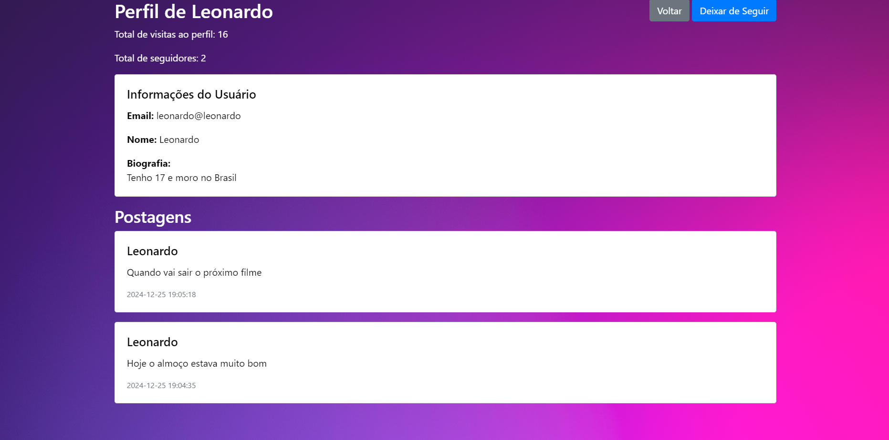

# Rede Social

Este é um sistema de rede social simples que permite aos usuários registrar-se, fazer login, criar postagens de texto, visualizar perfis de outros usuários, curtir postagens, seguir outros usuários, adicionar uma biografia ao próprio perfil e excluir sua conta.

## Funcionalidades

- **Registro e Login**: Os usuários podem criar uma nova conta e fazer login no sistema.
- **Postagens de Texto**: Após o login, os usuários podem criar postagens de texto com até 100 caracteres.
- **Feed de Postagens**: Os usuários podem visualizar as postagens de outros usuários em um feed ordenado por data de criação.
- **Curtir Postagens**: Os usuários podem curtir ou descurtir as postagens de outros usuários.
- **Seguir Usuários**: Os usuários podem seguir ou deixar de seguir outros usuários.
- **Perfis de Usuário**: Os usuários podem visualizar perfis de outros usuários, incluindo suas postagens e biografia.
- **Biografia no Perfil**: Os usuários podem adicionar ou editar uma biografia em seu próprio perfil.
- **Excluir Conta**: Os usuários podem excluir sua própria conta, removendo todas as suas informações do sistema.

## Estrutura do Projeto

- **database/db.php**: Arquivo de configuração para conexão com o banco de dados.
- **feed/feed.php**: Página principal do feed onde os usuários podem ver postagens.
- **image/image.php**: Script para manipulação de imagens.
- **login/login.php**: Página de login de usuários.
- **login/register.php**: Página de registro de novos usuários.
- **profile/profile.php**: Página de perfil de usuário.
- **social.sql**: Arquivo SQL contendo a estrutura do banco de dados.
- **index.html**: Página inicial que redireciona para o login.

## Configuração

1. **Clonar o Repositório**: Clone este repositório para o seu servidor local.

   ```bash
   git clone https://github.com/VitorGirottto/social.git
2. Configurar o Banco de Dados: Utilize o arquivo social.sql para criar o banco de dados necessário.

Crie um banco de dados chamado `social`.

Importe o arquivo `social.sql` para o banco de dados para criar as tabelas necessárias.
Configurar a Conexão com o Banco de Dados: Verifique se as credenciais de acesso ao banco de dados no arquivo `database/db.php` estão corretas.
   ```bash
<?php
$host = "localhost";
$dbname = "social";
$username = "root";
$password = "";

try {
    $db = new PDO("mysql:host=$host;dbname=$dbname", $username, $password);
    $db->setAttribute(PDO::ATTR_ERRMODE, PDO::ERRMODE_EXCEPTION);
} catch (PDOException $e) {
    echo "Erro de conexão: " . $e->getMessage();
    exit;
}
?>
````
3. Configurar o Servidor Web: Certifique-se de que o servidor web (por exemplo, Apache) esteja configurado para servir os arquivos deste projeto.

4. Acessar o Sistema: Abra o navegador e acesse http://localhost/social/login/login.php para iniciar o sistema.

### Tecnologias Utilizadas

PHP: Linguagem de programação utilizada para o backend.

MySQL: Banco de dados relacional para armazenar informações dos usuários e postagens.

HTML/CSS: Estrutura e estilo das páginas web.

Bootstrap: Framework CSS para estilização responsiva.

## Capturas de Tela
Tela de Login:



Feed de Postagens:



Perfil do Usuário:



Perfil de Outro Usuário:




